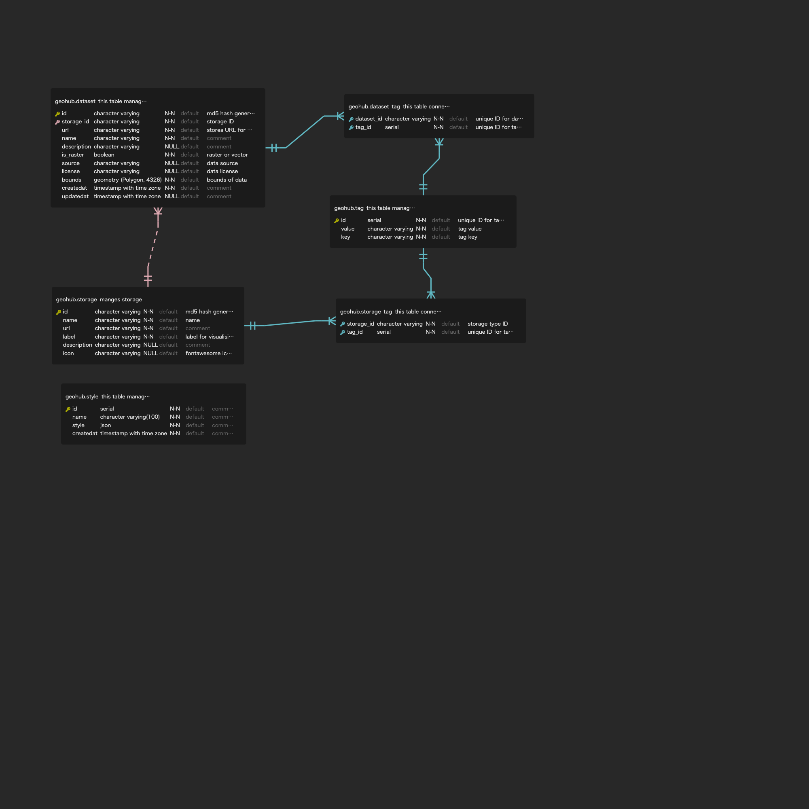

# geohub-cli

This repository is to manage CLI tools for geohub

## Usage

```shell
$geohub -h
Usage: geohub [options] [command]

Options:
  -v, --version     output the version number
  -h, --help        display help for command

Commands:
  azblob [options]  scan azure blob containers to register metadata into PostgreSQL database.
  help [command]    display help for command
```

```shell
$geohub azblob -h
Usage: geohub azblob [options]

scan azure blob containers to register metadata into PostgreSQL database.

Options:
  -d, --database <dsn>                           PostgreSQL database connection string
  -a, --azaccount <azure_storage_account>        Azure Storage Account
  -k, --azaccountkey <azure_storage_access_key>  Azure Storage Access Key
  -n, --name [container_name...]                 Targeted Azure Blob Container name to scan. It will scan all containers if it is not specified.
  -o, --output [output]                          Output directory for temporary working folder. Default is tmp folder (default: "tmp")
  -h, --help                                     display help for command
```

it takes approximately 23 minutes to finish importing all Azure blob containers (20 NO) of geohub.

## ER diagram

The following ER diagram was generated by [ERD Editor](https://marketplace.visualstudio.com/items?itemName=dineug.vuerd-vscode) extension for VS code.


